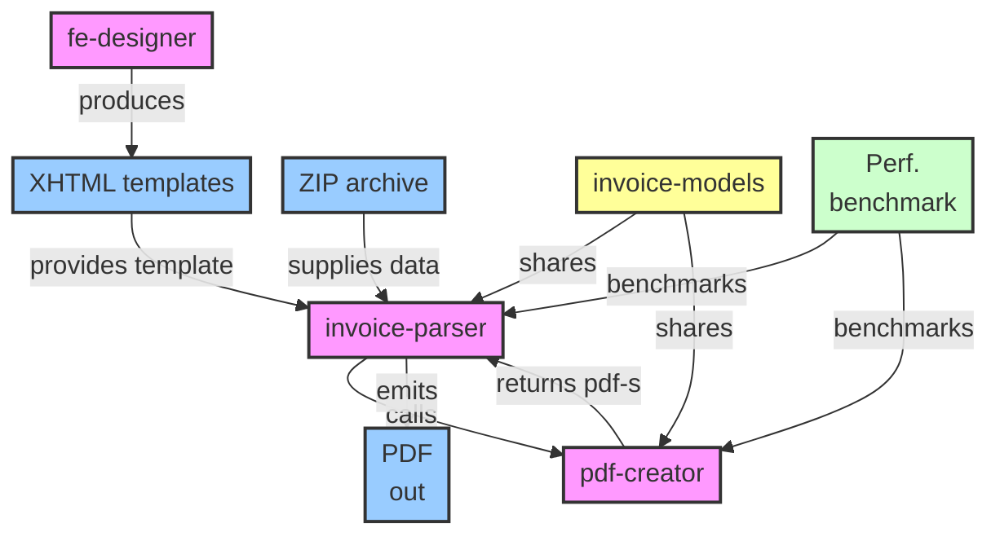

# Invoicing System Technical Documentation

> Status: Prototype - expect incomplete validation, limited resilience, and evolving contracts.

## 1. Executive Summary
This system transforms zipped source data into production-ready PDF invoices. It does so by (1) designing XHTML templates (fe-designer), (2) parsing heterogeneous ZIP payloads into a normalized JSON model (invoice-parser), and (3) rendering one PDF per debtor via a multi-threaded XHTML engine (pdf-creator). The Maven aggregator builds `invoice-models`, `invoice-parser`, `pdf-creator`, and `performance-benchmark`; the Angular frontend is built independently.

### 1.1 System Architecture Diagram


## 2. Module Overview
| Module | Role | IO | Stack | Risks |
|--------|------|----|-------|-------|
| fe-designer | Design XHTML templates | In: user input<br>Out: XHTML + meta | Angular CLI 21 | Unsupported CSS, malformed XHTML |
| invoice-parser | Parse ZIP, build JSON, orchestrate render | In: ZIP (classic/XML)<br>Out: JSONModel + render req | Java 25, Spring Boot 4 | Encoding drift, missing template |
| pdf-creator | Render PDFs from XHTML + data | In: XHTML + JSONModel<br>Out: Base64 PDF bytes | Java 25, Spring Boot 4, OpenHTMLToPDF | Thread contention, font/image gaps |
| performance-benchmark | Measure parser/renderer | In: parser/renderer artifacts<br>Out: JMH results (JSON) | Java 25, JMH | Unrepresentative baselines |

## 3. Core Data Contracts
### 3.1 Template
Well-formed XHTML (strict XML syntax) + placeholders `{{ path.to.field }}`. Must avoid unsupported CSS (e.g., complex flex/grid rules if renderer lacks full compliance).

### 3.2 JSONModel (Prototype Sample)
```json
{
  "debiteur": {
    "invoiceNumber": "12300164715071",
    "printDate": "26-09-2025",
    "hcpName": "Samenwerkende Tandartsen Made",
    "hcpStreet": "Duinstraat",
    "hcpHouseNr": "6",
    "hcpZipCode": "4921EA",
    "hcpCity": "Made",
    "hcpAgb": "",
    "practiceAgb": "38000182",
    "insuredId": "12300164715071",
    "patientName": "EAM Hessels",
    "street": "Antwerpsestraat",
    "houseNr": "35",
    "zipCode": "4921DD",
    "city": "MADE",
    "patientDob": "12-02-2004",
    "invoiceAmountCents": 6035,
    "openImfCents": 2345,
    "firstExpirationDate": "19-11-2025",
    "insurer": "Centrale Verwerkingseenheid CZ: CZ,  Nationale Nederlanden en OHRA",
    "periodFrom": "2025-09-26",
    "periodTo": "2025-10-26",
    "invoiceType": 20,
    "totalsAmount": 7146
  },
  "practitioner": {
    "agbCode": "3108000099",
    "logoNr": 0,
    "address": { "country": "", "postcode": "3532BL", "street": "Lindelaan", "houseNr": "17" },
    "practice": { "name": "Tandarts Sterrenwijk", "code": "", "phone": "" }
  },
  "treatments": [
    {
      "invoiceNumber": "12300164715071",
      "date": "2023-10-25",
      "treatmentCode": "Q241",
      "description": "Perio*Aid mondspoelmiddel 0.12% chlx 500ml",
      "treatmentProvider": "38000182",
      "amountCents": "895",
      "vatIndicator": "19",
      "vatValueCents": "178"
    }
  ],
  "totaalBedrag": 71.46
}
```
XML sources are out of scope for the current prototype.

### 3.3 Render Request / Response
Request: `{ xhtmlTemplateString, jsonModel }` -> Response: `{ pdfBytesBase64[] }` where length equals debtor line count (DebtorLinesCount).

## 4. Detailed Module Design
### 4.1 fe-designer
- Stack: Angular CLI 21, TypeScript, drag-and-drop component canvas.
- Output discipline: Restrict CSS to renderer-supported subset; enforce XHTML (close all tags, lowercase elements, quoted attributes).
- Metadata: `invoiceType`, `version`, optional preview assets for future validation.
- Scripts: `start.(bat|sh)`, `build.(bat|sh)`, `proxy.conf.json`.
- Pitfalls: Advanced layout features (flex/grid), remote fonts, unescaped characters in placeholders.
- Proposed Enhancements:
	- Live preview using pdf-creator
	- Schema-driven auto-complete for placeholders
	- Template manifest versioning
	- Lint step for XHTML.

### 4.2 invoice-parser
- Flow: ZIP ingest -> decode text files (classic + XML payloads) -> field extraction -> JSONModel assembly -> template selection -> render orchestration -> persist PDFs.
- Pitfalls: Memory spikes on large ZIPs; missing template for invoiceType
- Proposed Enhancements:
	- Streaming ZIP parsing
	- JSON Schema validation
	- Versioned template resolution with fallback
	- Structured metrics (parse_time_ms, render_time_ms), configurable backpressure (queue + thread pool).

### 4.3 pdf-creator
- Pipeline: Placeholder binding (null-safe, escaped) -> asset resolution (fonts/images cache) -> multi-threaded rendering -> Base64 encoding -> return.
- Pitfalls: Non thread-safe renderer internals; missing glyphs; large images causing heap pressure; partial CSS support gaps.
- Proposed Enhancements:
	- Precompile + cache templates
	- Font warming
	- Image downscaling
	- Alternative rendering engines (Chromium / wkhtmltopdf) abstraction layer

### 4.4 performance-benchmark
- Scope: JMH harness to measure parser and renderer throughput/latency with representative templates and JSONModels.
- Outputs: JSON/CSV benchmark reports (`jmh-result.json`, `fast-benchmark-result.json`).
- Considerations: Keep fixtures realistic; pin JVM flags consistently; use warmups to avoid skew.

## 5. Cross-Cutting Concerns
| Concern | Current State (Prototype) | Improvement Path |
|---------|---------------------------|------------------|
| Configuration | Properties/env; manual validation | Central schema + startup validation report |
| Error Handling | Ad-hoc messages | Structured error taxonomy + remediation hints |
| Security | Basic ZIP handling | Zip traversal protection, content-type & size guards |
| Observability | Limited logs | Correlation IDs, metrics, tracing (OpenTelemetry) |
| Performance | Unbounded parsing concurrency | Bounded queues, load shedding, profiling; reuse performance-benchmark baselines |
| Asset Management | Manual placement | Font/image registries + optimization pipeline |
| Platform Upgrades | Java 25 / Spring Boot 4 | Evaluate virtual threads, new logging/metrics defaults, dependency alignment |

## 6. Risks & Pitfalls Summary
1. Data variability -> parse failures / incorrect JSONModel.
2. Template mismatch or invalid XHTML -> render aborts.
3. Renderer feature gaps -> layout regressions.
4. Concurrency oversubscription -> memory/CPU exhaustion.
5. Windows path handling errors (backslash consistency).
6. Lack of versioning -> silent incompatibilities between JSONModel and templates.

## 7. Improvement Roadmap (Prioritized)
1. Contract Formalization: JSON Schema + template manifest (version, invoiceType, rendererCapabilities).
2. Preview Pipeline: Reuse pdf-creator engine in fe-designer for real-time validation.
3. Streaming & Validation: Incremental ZIP parsing with early rejection and memory ceilings.
4. Observability Foundation: Structured logging + metrics + correlation IDs.
5. Rendering Abstraction: Interface allowing multiple backends (current engine, Chromium) with capability negotiation.
6. Performance & Load Testing: Add scenario-based load tests to performance-benchmark module (JMH). 
7. Security Hardening: ZIP sandboxing, path sanitization, dependency scanning (OWASP).
8. Asset Optimization: Font subset generation, image compression (PNG/SVG optimization).

## 8. Future Features (Backlog)
- Real database persistence (audit & history).
- Securize the API.
- Template versioning & migration tooling.
- Custom component library (headers, line item tables, totals blocks).
- Logo/image management + optimization pipeline.
- Custom font management & fallback strategy.
- Nested template repetition (e.g., treatment groups, attachments).
- Unit & integration test suites (parser, renderer, template lint).
- Performance harness (JMH) & visual regression (pixel/DOM diff of PDFs).
- Enterprise scalability: horizontal workers, work queue, distributed cache.
- Structured logging + metrics + tracing across all modules.

## 9. Operational Guidelines
### Local Development
- fe-designer: `npm ci && npm run start` (Angular CLI dev server) for rapid template iteration; `npm run build` for production bundle.
- invoice-parser: Configure `inputFolder` / `outputFolder`; drop sample ZIPs (classic and XML variants); monitor logs.
- pdf-creator: Run isolated rendering tests with representative XHTML + JSONModel samples.
- performance-benchmark: `mvn clean package` to produce shaded JMH jar; run with consistent JVM flags for comparable baselines.

### Testing Strategy
| Layer | Goal | Tooling |
|-------|------|---------|
| Unit | Deterministic field extraction & placeholder binding | JUnit / Jasmine |
| Integration | End-to-end ZIP->PDF correctness | Spring Boot tests + sample fixtures |
| Visual | Layout consistency | PDF rendering baseline snapshots |
| Performance | Throughput & latency envelopes | JMH + load scripts |

### Deployment
Containerize modules independently; expose rendering via internal API or message bus; externalize configuration; automate health checks (template cache warm, font availability, disk space).

## 10. Security & Compliance Checklist (Initial)
- [ ] ZIP traversal prevention (normalize & block ".." entries)
- [ ] Size & count limits per ZIP
- [ ] Input encoding normalization (UTF-8)
- [ ] Placeholder injection safety (HTML entity escaping)
- [ ] Dependency vulnerability scanning
- [ ] Logged correlation IDs (no PII in logs)

## 11. Glossary
| Term | Definition |
|------|------------|
| Debtor | Entity for which an individual PDF invoice is generated |
| JSONModel | Normalized representation of parsed invoice data |
| Placeholder | Token within XHTML replaced by runtime values (e.g., `{{ debiteur.invoiceNumber }}`) |
| Manifest | Metadata object describing a template (type, version, capabilities) |

## 12. Summary
The prototype establishes clear separation of concerns but lacks formal contracts, validation depth, and operational robustness. Prioritizing contract formalization, preview rendering, and observability will yield the highest risk reduction early. The outlined roadmap guides evolution toward a production-grade, scalable invoicing platform.
